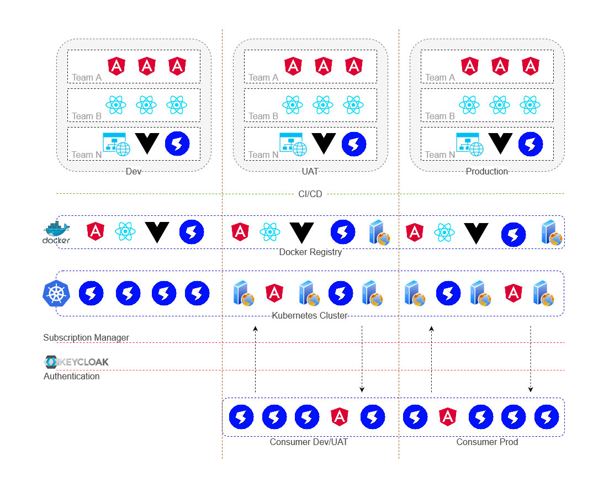

# CodeRuse Single SPA

Simple Single SPA POC built with https://single-spa.js.org

Till now we have only mounted various type of applications (Angular, React and Vue) onto Single-SPA default root config template.

### Configuration

``` bash
cd <project-location>/src/coderuse/angular
npm install
npm run serve:single-spa:hello-angular # runs the angular app at port 4200

# open another terminal
cd <project-location>/src/coderuse/react
npm install
npm start -- --port 8500 # runs the react app at port 8500

# open another terminal
cd <project-location>/src/coderuse/vue
npm install
# Vue by default enables hot reload and it has no default flag to disable this
# to by-pass this issue
npm run devw # it builds the vue app and watches for new file changes

# open another terminal and serve the built Vue app with cors enabled
# we can use other web server also to serve static content
cd <project-location>/src/coderuse/vue/dist
npm i -g http-server # if already not installed
http-server --cors

# open another terminal
cd <project-location>/src/spa
npm install
npm start # runs the Single-SPA app at port 9000
```

Access the Angular App at `http://localhost:9000/hello-angular`, React App at `http://localhost:9000/hello-react` and Vue app at `http://localhost:9000/hello-vue`.

### Roadmap

Still this project is at an nascent stage. A long way to go. We have put up a simple design diagram to describe our approach to achieve the Micro-Fronend architecture.


